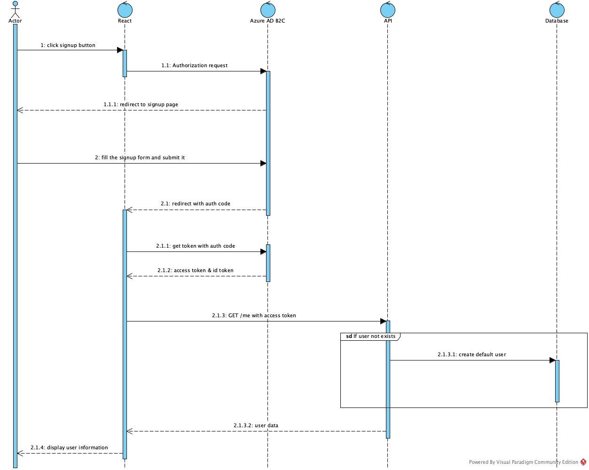
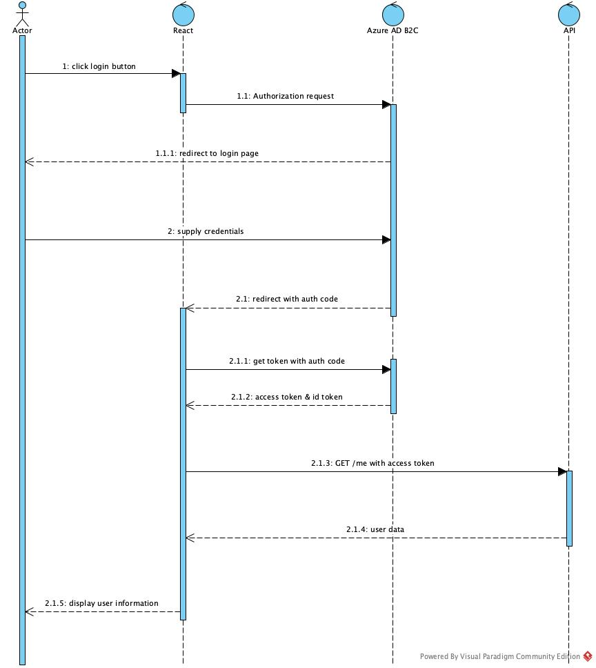

# Spring React MSAL using Azure AD B2C

This project is a sample project to demonstrate how to use Azure AD B2C with Spring Boot and React. The project is divided into two parts:

1. **backend**: A Spring Boot application that uses Azure AD B2C for authentication.

2. **frontend**: A React application that uses MSAL.js to authenticate with Azure AD B2C.

# What is Azure AD (Active Directory) B2C?

Azure AD B2C is a customer identity access management (CIAM) solution capable of supporting millions of users and billions of authentications per day. It helps you manage customer identities. It allows users to sign up, sign in, and manage their profiles in web and mobile applications. With Azure AD B2C, you can use different authentication methods like email, social accounts (such as Google or Facebook), or enterprise accounts. It's designed to offer secure, scalable identity management for apps, ensuring users can access your services easily and safely.

## CIAM (Customer Identity and Access Management)

- External User Identity Management: CIAM handles external identities like customers or partners, allowing them to access resources while keeping internal users separate.

- Self-Service Features: Allows external users to self-register, reset passwords, and manage their profiles.

- Single Sign-On (SSO): Provides seamless access across multiple applications using a single identity.

- Authentication and Authorization: Supports different authentication methods like multi-factor authentication (MFA), social logins (Google, Facebook, etc.), and standards-based authentication protocols (OAuth2, OpenID Connect, SAML).

- Security: CIAM provides security features like access control, risk-based authentication, and identity protection.

- Scalability and Performance: It is designed to handle large-scale customer bases with thousands or even millions of external users.

# Flow

## User Sign up

1. User clicks on the "Sign up" button in the React application.

2. React application redirects the user to the Azure AD B2C sign-up policy.

3. User fills the sign-up form and submits it.

4. Azure AD B2C sends a token to the React application.

5. React application sends the token to the Spring Boot application.

6. Spring Boot application validates the token and creates a user in the database.

7. Spring Boot application sends a response to the React application.

8. React application displays the user information.

## Use Login

1. User clicks on the "Login" button in the React application.

2. React application redirects the user to the Azure AD B2C sign-in policy.

3. User supplies the credentials and submits the form.

4. Azure AD B2C sends a token to the React application.

5. React application sends the token to the Spring Boot application.

6. Spring Boot application validates the token and sends a response to the React application.

7. React application displays the user information.
